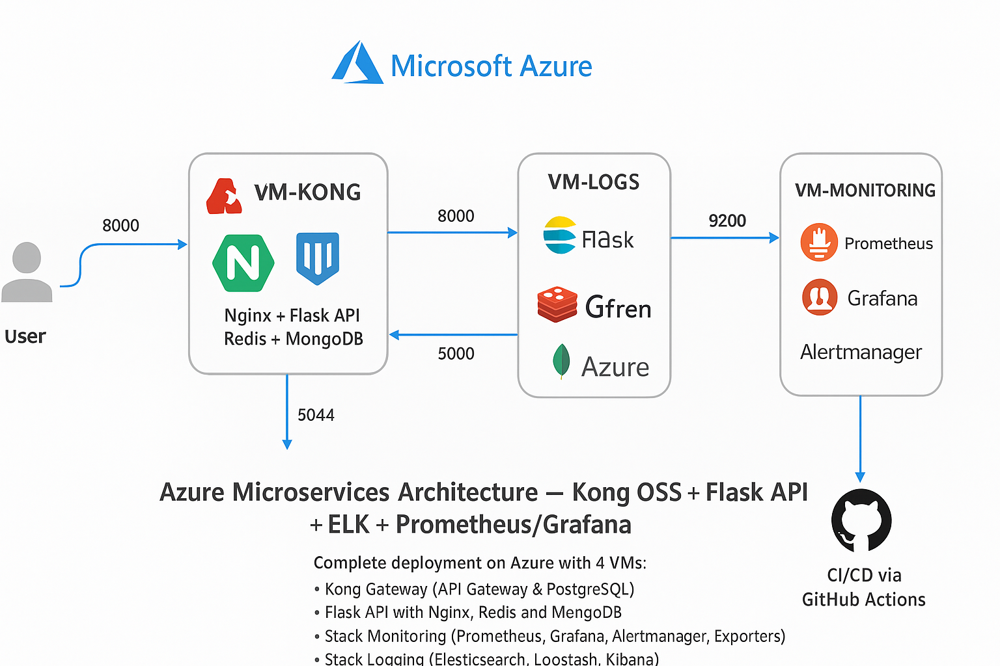
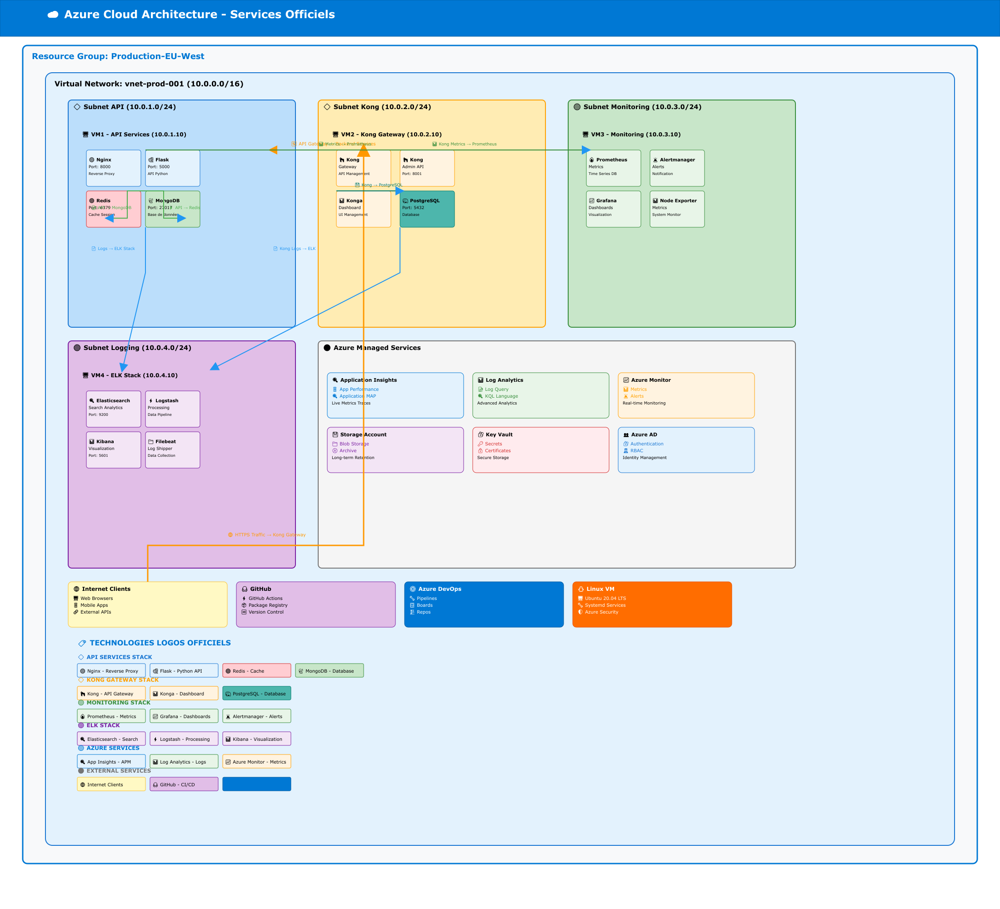

# Kong Stack Project — Azure deployment

This repository contains scripts and sources to deploy a Kong API Gateway + Flask API stack on Azure VMs, including monitoring and logging (Prometheus/Grafana, ELK).

## Tech Stack

| API Gateway | Web Server | Backend | Cache | Database | Logging | Metrics | Dashboards | Cloud |
|---|---|---|---|---|---|---|---|---|
|  |  |  |  |  |   |  |  |  |

## Architecture

### Kong Stack Architecture



### Azure Global Architecture



## Architecture Overview & Data Flows

### System Components

1. **User Layer**
   - External clients/users making requests

2. **VM-KONG (API Gateway)** 
   - **Port 8000**: Main API endpoint (user-facing)
   - Components:
     -  Kong Gateway (manages routing, authentication, rate limiting)
     -  Nginx (reverse proxy, load balancing)
     -  Flask API (backend application)
     -  Redis (caching, sessions)
     -  MongoDB (persistent data storage)

3. **VM-LOGS (Logging & Aggregation)** 
   - **Port 8000**: Data ingestion from Kong
   - **Port 9200**: Kibana UI
   - Components:
     -  Elasticsearch (log indexing and search)
     -  Kibana (log visualization dashboard)
     -  Gfren (log forwarder)
     -  Azure (cloud integration for log storage)

4. **VM-MONITORING (Metrics & Alerting)** 
   - **Port 9200**: Prometheus metrics endpoint
   - **Port 3000**: Grafana dashboard UI
   - Components:
     -  Prometheus (metrics collection and storage)
     -  Grafana (metrics visualization)
     -  Alertmanager (alert routing and grouping)
     -  Exporters (MongoDB exporter, Redis exporter)

### Request Flow (Step-by-Step)

1. **Incoming User Request**
   - User sends HTTP request to Kong Gateway (Port 8000)
   - Kong validates authentication and applies rate limiting

2. **API Processing**
   - Kong routes request to Flask API
   - Flask checks Redis cache for quick response
   - If cache miss, Flask queries MongoDB for data

3. **Response Path**
   - Flask returns response to Kong
   - Kong sends HTTP response back to user

4. **Logging**
   - Kong logs request/response metadata
   - Logs shipped to VM-LOGS via Gfren
   - Elasticsearch indexes logs for searchability
   - Kibana displays logs in real-time dashboard

5. **Monitoring**
   - Prometheus scrapes metrics from all services:
     - Kong metrics (requests, latency, errors)
     - MongoDB metrics (via mongodb_exporter)
     - Redis metrics (via redis_exporter)
   - Grafana visualizes metrics with dashboards
   - Alertmanager triggers alerts on anomalies

### Key Ports & Services

| VM | Port | Service | Purpose |
|---|---|---|---|
| VM-KONG | 8000 | Kong API Gateway | API requests |
| VM-KONG | 6379 | Redis | Caching |
| VM-KONG | 5044 | MongoDB | Data persistence |
| VM-LOGS | 8000 | Elasticsearch Ingest | Log aggregation |
| VM-LOGS | 9200 | Kibana | Log visualization |
| VM-MONITORING | 9200 | Prometheus | Metrics collection |
| VM-MONITORING | 3000 | Grafana | Metrics dashboard |

## Deployment

To deploy this stack on Azure, use the scripts in the `infrastructure/` directory. Each VM requires specific setup scripts for dependencies and services.

## Quick Start

```bash
# Deploy API VM
cd infrastructure/api-vm
./deploy-api.sh

# Or deploy source directly
cd src/stock-api
./start.sh
```
